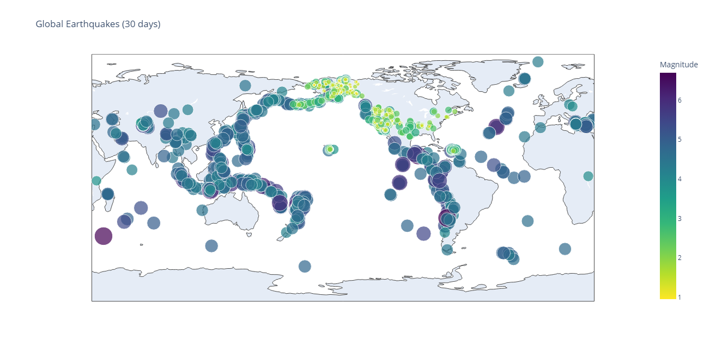
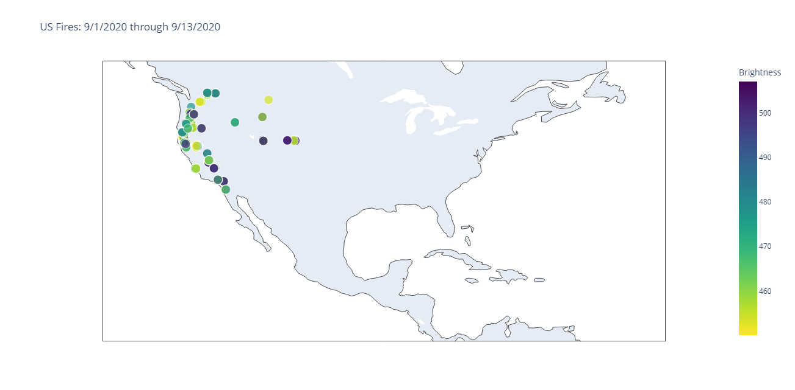
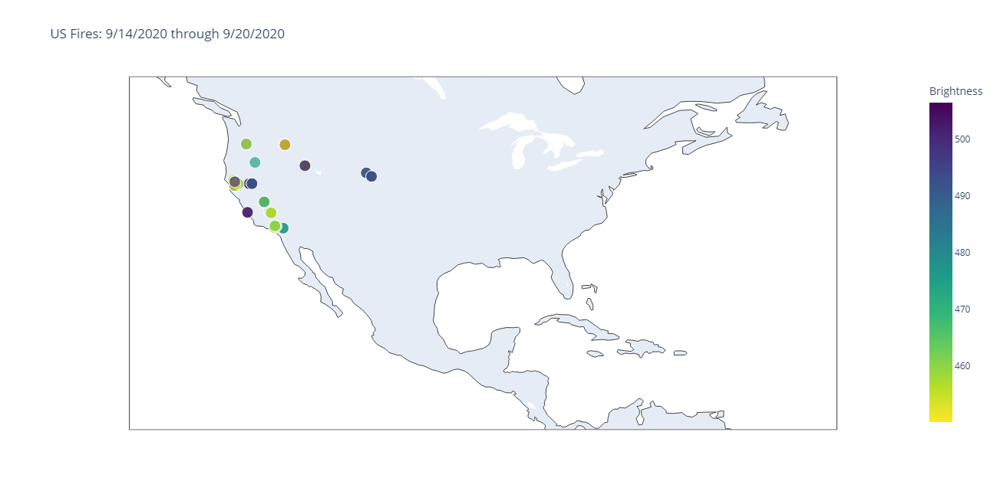

# Python Demo: JSON + Plotly

This project has three sample datasets stored in JSON files. The goal was to import data from the JSON files and visualize them using python to derive any insight.

## Global Earthquakes

One JSON file contains global earthquake data for 30 days from January 18 through February 16, 2019. Magnitude, geolocation (longitude, latitude), and name of the place of earthquakes were scrapped from the JSON file and were plotted using the Plotly library.

From the visualization, the [Ring of Fire](https://en.wikipedia.org/wiki/Ring_of_Fire) can be observed which is a region around much of the rim of the Pacific Ocean where many volcanic eruptions and earthquakes occur.

## US Fires

The other two JSON files contain US fire incidents around the West Coast area from September 1 through September 13, 2020, and September 14 through September 20, 2020, respectively. Geolocation (longitude, latitude) and intensity of the fire incidents that had a brightness factor of more than 450 were scrapped from the JSON files and were plotted using the Plotly library.

From the visualization, it can be observed that there were several high-intensity fire incidents around the West Coast area from September 1 through September 13, 2020, which were reduced significantly by the next week (September 14 through September 20, 2020).

